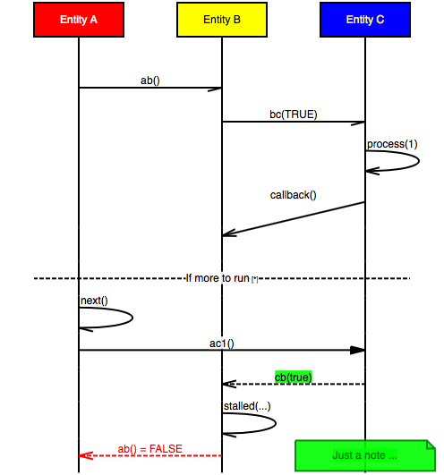

# mscgen_js
*Turns text into sequence charts.*

[](https://travis-ci.org/sverweij/mscgen_js)
[](https://codeclimate.com/github/sverweij/mscgen_js)
[](https://codeclimate.com/github/sverweij/mscgen_js)
- Implementation of the super easy [mscgen][1] in javascript.
- [Embeddable][30] in your html.
- Try it in the [interactive interpreter][2].
- Also
  - talks a [simplified subset of mscgen][5] for lazy bastards.
  - speaks a [superset of mscgen][29] for the feature hungry.
  - runs in all modern browsers (and in ~~_node.js_~~ _io.js_).
  - animates your chart.

## Sample
This sequence chart ...



was made with this *mscgen* source:

    msc {
      a [ label="Entity A", textbgcolor="red", textcolor="white" ],
      b [ label="Entity B", textbgcolor="yellow" ],
      c [ label="Entity C", textbgcolor="blue", textcolor="yellow" ];

      a->b [ label = "ab()" ] ;
      b->c [ label = "bc(TRUE)"];
      c=>>c [ label = "process(1)" ];
      b<<=c [ label = "callback()", arcskip="1"];
      |||;
      ---  [ label = "If more to run", ID="*" ];
      a->a [ label = "next()"];
      a=>c [ label = "ac1()"];
      b<<c [ label = "cb(true)", textbgcolor="lime"];
      b->b [ label = "stalled(...)"];
      a<<b [ label = "ab() = FALSE", textcolor="red", linecolor="red"],
      c note c [ label="Just a note ...", linecolor="green",
                textcolor="green", textbgcolor="lime" ];
    }


## mscgen_js and the mscgen standard
mscgen_js was made to go both ways:

- Accept all valid [mscgen][1] programs and render them correctly.
- Have all valid mscgen programs accepted by mscgen_js accepted and rendered
  correctly by mscgen.

Moreover [ms genny][5], the simplified subset, translates to mscgen with the
flip of a switch.

If you find proof to the contrary on any of this [tell us][6].


## Building mscgen_js yourself

See [build.md][7]. If you want to understand how mscgen_js' innards work:
we try to explain that [here][33].

## License information
This software is free software [licensed under GPLv3][3]. This means (a.o.) you _can_ use
it as part of other free software, but _not_ as part of non free software.


### Commercial use of embedding mscgen
In addition to the GNU public license, for the use of the minified version of the embedding code
(```mscgen-inpage.js```) as described on [embedding][30] a special exception
to the GPL is made:  

> As a special exception to the GPL, any HTML file which merely makes
function calls to mscgen-inpage.js, and for that purpose includes
it by reference shall be deemed a separate work for copyright law
purposes. In addition, the copyright holders of this code give you
permission to combine this code with free software libraries that
are released under the GNU LGPL. You may copy and distribute such
a system following the terms of the GNU GPL for this code and the
LGPL for the libraries. If you modify this code, you may extend
this exception to your version of the code, but you are not obligated
to do so. If you do not wish to do so, delete this exception statement
from your version.

### Dependencies and their licenses
mscgen_js is built on various libraries, each of which have their own license (incidentally all
MIT style):
- [requirejs][19] is used for modularization.
- The bare (embedding only) mscgen_js is packaged using requirejs and [almond][31] to be able to run as a stand alone, dependency less package.
- Parsers are generated with [pegjs][12].
- The on line interpreter additionally uses [codemirror][13] and [canvg][16].
- To run in node, mscgen_js uses [jsdom][25] and [amdefine][20].

Icons courtesy of Dmitry Baranovskiy [license][15].

- Icons in the animation, were created with the [IcoMoon App](https://icomoon.io/app/).
At the time the font was created it was licensed
[GPLv3](http://www.gnu.org/licenses/gpl.html) or
[CC BY 4.0](https://creativecommons.org/licenses/by/4.0/)

It uses [mocha][21], [istanbul][28], [jshint][22], [plato][23] and
[nsp][35] to maintain some modicum of verifiable code quality.
You can see the build history in [Travis](https://travis-ci.org/sverweij/mscgen_js) and an indication of the
shape of the code at [Code Climate ](https://codeclimate.com/github/sverweij/mscgen_js).

## Thanks
- [Mike McTernan][1] for creating the wonderful mscgen standard, the accompanying c implementation and for
  releasing both to the public domain (the last one under a [GPLv2][18] license to be precise).
- [David Majda][8] for cooking and maintaining the fantastic and lightning fast [PEG.js][9] parser generator.
- [Marijn Haverbeke][10] for the snazzy [CodeMirror][11] editor component.
- Gabe Lerner for the [canvg][17] library, which makes converting vector graphics to rasters _almost_
  like a walk in the park.
- [Elijah Insua][24] for [jsdom][34], which makes it possible to render vector graphics in ~~node.js~~ io.js.
- [Audrey M. Roy](http://www.audreymroy.com/) for the excelent ["painfully obsessive cheat sheet to favicon sizes/types."](https://github.com/audreyr/favicon-cheat-sheet).

[1]: http://www.mcternan.me.uk/mscgen
[2]: https://sverweij.github.io/mscgen_js
[3]: wikum/licenses/license.mscgen_js.md
[5]: wikum/msgenny.md
[6]: https://github.com/sverweij/mscgen_js/labels/compliance
[7]: wikum/build.md
[8]: http://majda.cz/en/
[9]: http://pegjs.majda.cz/
[10]: http://marijnhaverbeke.nl
[11]: http://codemirror.net
[12]: wikum/licenses/license.pegjs.md
[13]: wikum/licenses/license.codemirror.md
[15]: wikum/licenses/license.icons.md
[16]: wikum/licenses/license.canvg.md
[17]: https://github.com/gabelerner/canvg
[18]: http://code.google.com/p/mscgen/source/browse/trunk/COPYING
[19]: wikum/licenses/license.requirejs.md
[20]: wikum/licenses/license.amdefine.md
[21]: wikum/licenses/license.mocha.md
[22]: wikum/licenses/license.jshint.md
[23]: wikum/licenses/license.plato.md
[24]: http://tmpvar.com/
[25]: wikum/licenses/license.jsdom.md
[26]: http://cs.brown.edu/~dap/
[27]: https://npmjs.org/package/posix-getopt
[28]: wikum/licenses/license.istanbul.md
[29]: wikum/xu.md
[30]: https://sverweij.github.io/mscgen_js/embed.html
[31]: https://github.com/jrburke/almond
[33]: src/script
[34]: https://github.com/tmpvar/jsdom
[35]: https://nodesecurity.io/
