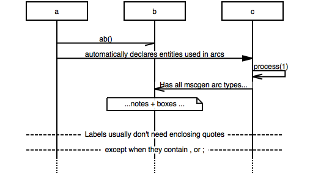

ms genny
========
_Low effort labeling. Auto declarations_

mscgen already is a simple, concise, well readable language. Write-ability
leaves room for improvement, though.

The *ms genny* language is our attempt to fill that room. It does away with some of 
mscgen's more fancy features in favor of low effort labeling
and automatic entity declarations. See below for a complete comparison chart.

To have our cake and eat it too we made the [online demo][4] translate between
the two with the flick of a switch. 

Example
-------

    a -> b : ab();
    a => c : automatically declares entities used in arcs;
    c =>> c : process(1);
    b <<= c : Has all mscgen arc types... ;
    b note b: ...notes + boxes ...;
    |||;
    --- : Labels usually don't need enclosing quotes;
    --- : "except when they contain , or ;";
    ...;

this renders as

Usage scenarios
---------------
We often find ourselves starting a sequence chart in *ms genny*, and, when
we're done, converting it to *mscgen* (one click in the on line demo). After
that we finish it of with coloring or to directly save the source ande the 
renedered picture to the documentation.

Of course directly using the output from *ms genny* is possible as well.

A note on quotes 
----------------
Just like in *mscgen*, in *ms genny* labels need to be surrounded by quotes. 
To make entry more easy, however, in most cases *ms genny* allows you to 
skip the quotes. Only when a label contains a comma or a semicolon, enclosing 
quotes are mandatory. This is because in those cases the parser won't be able to
figure out when the declaration of the arc (or entity) would end:

    a => b : "hello b";  # works
    a => b :  hello b;   # works
    a => b : "hello; b"; # works
    a => b :  hello; b;  # doesn't work; confuses the parser to think the arc line stops after hello
    a => b : "hello, b"; # works
    a => b :  hello, b;  # doesn't work; confuses the parser to think the arc stops after hello

Formal syntax
-------------
The formal syntax is described in a [parsing expression grammar (peg)][1]. It's 100% accurate
as it is used to generate the parser.

Feature comparison
------------------
As mentioned above the [online demo][4] converts between *mscgen* and *ms genny*.
Moreover, the source code tree contains two node.js scripts [smpl2msc.js][2] and
[msc2smpl.js][3] which perform the translations from the command line. 

Note: obviously features not supported by *ms genny* get lost in translation.

<table>
    <tr><th>feature</th><th>mscgen</th><th>ms genny</th></tr>
    <tr>
        <td>explicit entity declaration</td>
        <td>mandatory</td>
        <td>supported</td>
    </tr>
    <tr>
        <td>implicit entity declaration</td>
        <td>not supported</td>
        <td>supported</td>
    </tr>
    <tr>
        <td>labels on entities</td>
        <td><code>entity_name [label="this is the label"]</code></td>
        <td><code>entity_name : this is the label</code></td>
    </tr>
    <tr>
        <td>labels on arcs, notes, boxes</td>
        <td><code>a =>> b [label="this is the label"];</code></td>
        <td><code>a =>> b : this is the label;</code></td>
    </tr>
    <tr>
        <td>explicit declaration of start and end of the program</td>
        <td>A mscgen program must start with <code>msc {</code> must be ended by a <code>}</code></td>
        <td>Needed nor supported</td>
    </tr>
    <tr>
        <td>arc types</td>
        <td>a lot</td>
        <td>same as mscgen</td>
    </tr>
    <tr>
        <td>notes, boxes, empty arcs</td>
        <td>supported</td>
        <td>same as mscgen</td>
    </tr>
    <tr>
        <td>parallel calls</td>
        <td>use a comma between arcs: <code>a=>b, a=>c;</code></td>
        <td>same as mscgen</td>
    </tr>
    <tr>
        <td>broadcasts</td>
        <td>Use an asterisk as <em>to</em> or <em>from</em>: <code>a=>*;</code></td>
        <td>same as mscgen</td>
    </tr>
    <tr>
        <td>options</td>
        <td>hscale, arcgradient, width, wordwraparcs </td>
        <td>same as mscgen</td>
    </tr>
    <tr>
        <td>comments</td>
        <td><code># single line</code>-style, <code>// C++ type single line</code>-style and <code>/* multi line */</code>-style</td>
        <td>same as mscgen</td>
    </tr>
    <tr>
        <td>entity names</td>
        <td><code>alphanumericalstrings</code>, <code>"quoted strings"</code>  and <code>481</code> numbers</td>
        <td>same as mscgen</td>
    </tr>
    <tr>
        <td>colors</td>
        <td>lines, text, background on entities, arcs and notes</td>
        <td>not supported</td>
    </tr>
    <tr>
        <td>coloring all arcs departing from an entity</td>
        <td>declare by using the <code>arc*</code> property variants on the entity</td>
        <td>not supported</td>
    </tr>
    <tr>
        <td>id, url, idurl</td>
        <td>supported</td>
        <td>not supported</td>
    </tr>
</table>

[1]: script/node/mscgensmplparser.pegjs
[2]: script/node/smpl2msc.js
[3]: script/node/msc2smpl.js
[4]: http://sverweij.github.io/mscgen_js/
